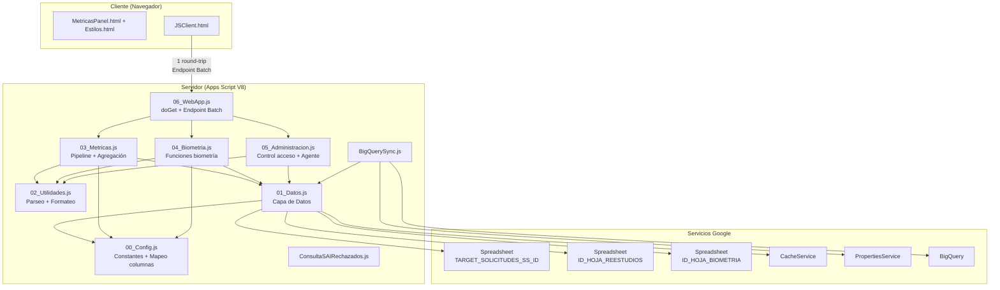
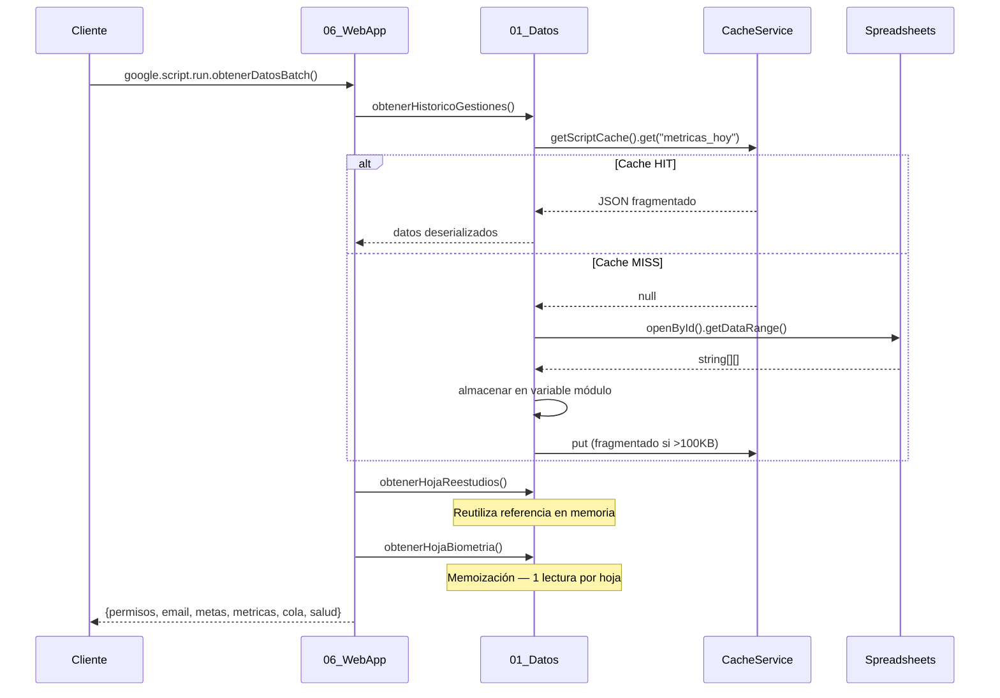

# Documento de Diseño: Performance Refactor

## Overview

Este documento describe el diseño técnico para la refactorización de rendimiento del proyecto **metricas_analisis**. El objetivo principal es reducir drásticamente la latencia del dashboard eliminando lecturas redundantes de hojas de cálculo, consolidando lógica duplicada, e implementando patrones de caché y batch.

### Decisiones de Diseño Clave

| Decisión | Justificación |
|----------|---------------|
| Patrón memoización con variables de módulo | El runtime V8 de Apps Script no persiste estado entre invocaciones, pero dentro de una misma ejecución las variables globales/módulo sí permanecen. Memoizar con `var _cache = null` es la forma más simple y eficiente. |
| CacheService con particionamiento | El límite de 100KB por clave obliga a fragmentar datasets grandes. Un esquema de índice + fragmentos secuenciales permite reconstruir transparentemente. |
| Endpoint batch único | Cada `google.script.run` genera un round-trip HTTP completo (~300-800ms overhead). Agrupar 6 llamadas en 1 reduce latencia de ~3-5s a <1.5s solo en overhead de red. |
| Archivos con prefijo numérico | Apps Script carga archivos en orden alfabético. Los prefijos `00_` a `06_` garantizan que configuración y datos se inicialicen antes que las funciones consumidoras. |
| Lectura amplia para Historico_Gestiones | Múltiples funciones consumen diferentes subconjuntos de columnas. Una sola lectura con `getDataRange()` es más eficiente que múltiples `getRange()` parciales. |

---

## Architecture

### Diagrama de Arquitectura General



### Flujo de Datos — Carga Inicial del Dashboard



---

## Components and Interfaces

### 1. 00_Config.js — Constantes y Mapeo de Columnas

```javascript
// Interfaz pública (scope global):

/** IDs de Spreadsheets */
const TARGET_SOLICITUDES_SS_ID = "...";
const ID_HOJA_REESTUDIOS = "...";
const ID_HOJA_BIOMETRIA = "...";

/** Configuración de tiempo */
const TIMEZONE = "America/Bogota";
const HORA_INICIO_OPERACION = "08:00";
const HORA_FIN_TURNO = "17:00";

/** Caché */
const CACHE_TTL_SEGUNDOS = 300;
const CACHE_MAX_FRAGMENTO_KB = 95;
const CACHE_MAX_FRAGMENTOS = 20;

/** Mapeo de columnas por hoja */
const COL_HISTORICO = {
  SOLICITUD: 0,
  POLIZA: 1,
  ESTADO_GENERAL: 16,
  CLASE: 20,
  FECHA_ASIGNACION: 24,
  CORREO_ANALISTA: 25,
  FECHA_FIN: 26,
  NOMBRE_ANALISTA: 27,
  MINUTOS_COLA: 34,
  MINUTOS_GESTION: 35,
  MINUTOS_GENERAL: 36,
  TIPO_ASIGNADO: 60
};

const COL_SOLICITUD = {
  ESTADO_GENERAL: 16,
  CLASE: 20
};

const COL_REESTUDIOS = {
  // ... índices específicos
};

const COL_BIOMETRIA = {
  // ... índices específicos según colMap dinámico
};
```

### 2. 01_Datos.js — Capa de Datos (Data Layer)

```javascript
/**
 * Capa de Datos — Memoización por ciclo de ejecución + CacheService.
 *
 * Patrón: Cada función de lectura usa una variable de módulo como caché
 * en memoria. Dentro de una misma invocación del servidor, la primera
 * llamada lee el spreadsheet; las siguientes retornan la referencia
 * almacenada. Entre invocaciones, el runtime destruye las variables,
 * garantizando datos frescos.
 */

// --- Variables de módulo (caché intra-ejecución) ---
var _historicoGestiones = null;
var _hojaReestudios = null;
var _hojaOrigen = null;
var _hojaBiometria = null;
var _hojaSolicitud = null;
var _ssReestudios = null;  // instancia del spreadsheet compartida

/**
 * Lee Historico_Gestiones. Lanza error si no es accesible.
 * @returns {string[][]} Arreglo bidimensional incluyendo encabezados.
 */
function obtenerHistoricoGestiones() { ... }

/**
 * Lee la pestaña Historico_Gestiones de Reestudios.
 * Retorna [] si hay error (degradación graceful).
 * @returns {string[][]}
 */
function obtenerHojaReestudios() { ... }

/**
 * Lee la pestaña ORIGEN del spreadsheet de Reestudios.
 * Reutiliza la instancia _ssReestudios ya abierta.
 * @returns {string[][]}
 */
function obtenerHojaOrigen() { ... }

/**
 * Lee pendiente_biometria. Retorna [] si la hoja no existe o tiene <2 filas.
 * @returns {string[][]}
 */
function obtenerHojaBiometria() { ... }

/**
 * Lee la hoja "solicitud" de TARGET_SOLICITUDES_SS_ID.
 * @returns {string[][]}
 */
function obtenerHojaSolicitud() { ... }

// --- CacheService: Particionamiento ---

/**
 * Almacena datos en CacheService con particionamiento automático.
 * @param {string} claveBase - Clave base (ej. "metricas_01/01/2024_31/01/2024")
 * @param {object} datos - Objeto serializable
 */
function _cachePut(claveBase, datos) { ... }

/**
 * Lee datos particionados de CacheService.
 * @param {string} claveBase
 * @returns {object|null} Datos deserializados o null si cache miss/error
 */
function _cacheGet(claveBase) { ... }

/**
 * Invalida todas las claves asociadas a un dataset.
 * @param {string} claveBase
 */
function invalidarCache(claveBase) { ... }
```

**Pseudocódigo — obtenerHistoricoGestiones:**

```
function obtenerHistoricoGestiones():
  if _historicoGestiones != null:
    return _historicoGestiones

  ss = SpreadsheetApp.openById(TARGET_SOLICITUDES_SS_ID)
  hoja = ss.getSheetByName(SHEET_NAME_SOLICITUDES)
  
  if hoja == null:
    throw Error("Hoja Historico_Gestiones no encontrada en spreadsheet " + TARGET_SOLICITUDES_SS_ID)
  
  _historicoGestiones = hoja.getDataRange().getDisplayValues()
  return _historicoGestiones
```

**Pseudocódigo — _cachePut (particionamiento):**

```
function _cachePut(claveBase, datos):
  json = JSON.stringify(datos)
  cache = CacheService.getScriptCache()
  
  if json.length <= 100000:  // ≤100KB, cabe en una clave
    cache.put(claveBase, json, CACHE_TTL_SEGUNDOS)
    cache.put(claveBase + "_idx", "1", CACHE_TTL_SEGUNDOS)
    return
  
  // Particionar en fragmentos de ≤95KB
  fragmentos = []
  for i = 0; i < json.length; i += 95000:
    fragmentos.push(json.substring(i, i + 95000))
  
  if fragmentos.length > CACHE_MAX_FRAGMENTOS:
    Logger.log("Dataset excede límite de fragmentos, no se cachea: " + claveBase)
    return
  
  pares = {}
  for idx = 0; idx < fragmentos.length; idx++:
    pares[claveBase + "_part" + idx] = fragmentos[idx]
  
  pares[claveBase + "_idx"] = String(fragmentos.length)
  cache.putAll(pares, CACHE_TTL_SEGUNDOS)
```

**Pseudocódigo — _cacheGet (lectura particionada):**

```
function _cacheGet(claveBase):
  try:
    cache = CacheService.getScriptCache()
    idxStr = cache.get(claveBase + "_idx")
    if idxStr == null: return null
    
    numParts = parseInt(idxStr, 10)
    if numParts == 1:
      json = cache.get(claveBase)
      return json ? JSON.parse(json) : null
    
    // Leer todos los fragmentos
    claves = []
    for i = 0; i < numParts; i++:
      claves.push(claveBase + "_part" + i)
    
    partes = cache.getAll(claves)
    
    // Verificar que todos los fragmentos existan
    json = ""
    for i = 0; i < numParts; i++:
      parte = partes[claveBase + "_part" + i]
      if parte == null: return null  // fragmento faltante → cache miss
      json += parte
    
    return JSON.parse(json)
  catch(e):
    Logger.log("Error leyendo cache " + claveBase + ": " + e.message)
    return null
```

### 3. 02_Utilidades.js — Helpers de Parseo y Formateo

```javascript
/**
 * Parsea una cadena de fecha en múltiples formatos soportados.
 * Formatos: dd/MM/yyyy, dd-MM-yyyy, yyyy-MM-dd, YYYYMMDD, dd/MM/yyyy HH:mm:ss
 * @param {string} str - Cadena a parsear
 * @returns {Date|null} Objeto Date o null si no se pudo parsear
 */
function parsearFecha(str) { ... }

/**
 * Normaliza una fecha de dd/MM/yyyy a yyyy-MM-dd para ordenamiento/comparación.
 * @param {string} fechaDDMMYYYY - Fecha en formato dd/MM/yyyy
 * @returns {string} Fecha en formato yyyy-MM-dd
 */
function normalizarFechaISO(fechaDDMMYYYY) { ... }

/**
 * Clasifica el estado de una gestión en categorías estándar.
 * @param {string} estadoRaw - Estado sin normalizar
 * @returns {'APROBADO'|'RECHAZADO'|'APLAZADO'|'OTRO'}
 */
function clasificarEstado(estadoRaw) { ... }

/**
 * Parsea un valor de tiempo en minutos (string con coma o punto decimal).
 * @param {string} raw - Valor crudo de la celda
 * @returns {number|NaN}
 */
function parsearTiempoMinutos(raw) { ... }

/**
 * Determina si una fecha cae dentro de un rango [desde, hasta].
 * @param {Date} fecha - Fecha a evaluar
 * @param {Date} desde - Inicio del rango (inclusive)
 * @param {Date} hasta - Fin del rango (inclusive, 23:59:59)
 * @returns {boolean}
 */
function fechaEnRango(fecha, desde, hasta) { ... }

/**
 * Normaliza texto para matching de tipo asignado.
 * @param {string} valor
 * @returns {string}
 */
function normalizarTipoAsignado(valor) { ... }
```

**Pseudocódigo — parsearFecha:**

```
function parsearFecha(str):
  if str == null || str.trim() == "": return null
  
  s = str.trim()
  
  // Formato compacto YYYYMMDD (8 dígitos)
  if /^\d{8}$/.test(s):
    return new Date(s[0:4], s[4:6] - 1, s[6:8])
  
  // Formato con hora: dd/MM/yyyy HH:mm:ss
  if s.contains(" "):
    partes = s.split(" ")
    fecha = parsearFecha(partes[0])  // recursión para la parte de fecha
    if fecha == null: return null
    horaParts = partes[1].split(":")
    fecha.setHours(horaParts[0], horaParts[1], horaParts[2] || 0)
    return fecha
  
  // Separador "/"
  if s.contains("/"):
    p = s.split("/")
    return new Date(p[2], p[1] - 1, p[0])
  
  // Separador "-"
  if s.contains("-"):
    p = s.split("-")
    if p[0].length == 4:  // yyyy-MM-dd
      return new Date(p[0], p[1] - 1, p[2])
    else:                  // dd-MM-yyyy
      return new Date(p[2], p[1] - 1, p[0])
  
  return null
```

### 4. 03_Metricas.js — Pipeline de Procesamiento Compartido

```javascript
/**
 * Pipeline compartido de procesamiento de filas.
 * Itera Historico_Gestiones + Reestudios, aplica filtros, clasifica y agrega.
 *
 * @param {object} opciones
 * @param {Date} opciones.desde - Fecha inicio del rango
 * @param {Date} opciones.hasta - Fecha fin del rango (23:59:59)
 * @param {boolean} [opciones.incluirReestudios=true]
 * @param {boolean} [opciones.incluirBacklog=false]
 * @param {function} [opciones.procesarFila] - Callback por fila filtrada
 * @returns {object} Resultado agregado con métricas base
 */
function _procesarFilasMetricas(opciones) { ... }

/**
 * obtenerDatosMetricas refactorizado — delega al pipeline.
 * Mantiene firma y retorno idénticos al original.
 * @param {string} fechaDesde - dd/MM/yyyy
 * @param {string} fechaHasta - dd/MM/yyyy
 * @returns {object} Estructura completa de métricas del dashboard
 */
function obtenerDatosMetricas(fechaDesde, fechaHasta) { ... }

/**
 * obtenerRendimientoPorDia refactorizado — delega al pipeline.
 * @param {string} fechaFiltro - dd/MM/yyyy (fecha única)
 * @returns {object} Rendimiento detallado del día
 */
function obtenerRendimientoPorDia(fechaFiltro) { ... }

/**
 * _agente_leerDatosRango refactorizado — delega al pipeline.
 * @param {string} fechaDesdeStr - dd/MM/yyyy
 * @param {string} fechaHastaStr - dd/MM/yyyy
 * @returns {object} Datos para el agente coordinador
 */
function _agente_leerDatosRango(fechaDesdeStr, fechaHastaStr) { ... }

// --- Helpers de agregación ---

/**
 * Filtro compartido de filas por fecha.
 * @param {string[][]} datos - Datos de la hoja
 * @param {Date} desde
 * @param {Date} hasta
 * @param {number} colFecha - Índice de la columna de fecha
 * @returns {Array<{fila: string[], fecha: Date, fechaStr: string}>}
 */
function _filtrarFilasPorRango(datos, desde, hasta, colFecha) { ... }

/**
 * Resuelve nombre y especialidad de un analista por correo.
 * Usa datos de la hoja Usuarios desde Capa_de_Datos.
 * @param {string} correo
 * @returns {{nombre: string, especialidad: string}}
 */
function _resolverAnalista(correo) { ... }
```

**Pseudocódigo — _procesarFilasMetricas:**

```
function _procesarFilasMetricas(opciones):
  desde = opciones.desde
  hasta = opciones.hasta
  hasta.setHours(23, 59, 59, 999)
  
  // Obtener datos desde Capa_de_Datos (memoizados)
  dataHistorico = obtenerHistoricoGestiones()
  dataReestudios = opciones.incluirReestudios ? obtenerHojaReestudios() : []
  scoreMap = cargarDiccionarioScore()
  
  resultado = {
    totalGestionadas: 0,
    aprobadas: 0, negadas: 0, aplazadas: 0,
    fueraDeSLA: 0,
    sumaTiempos: 0, countTiempos: 0,
    sumaTiemposResolucion: 0, countTiemposResolucion: 0,
    sumaTiempoCola: 0, countTiempoCola: 0,
    produccionMap: {}, slaMap: {}, analistaMap: {},
    segmentoInmobMap: {}, tipoMap: {},
    backlogDetalle: [], registros: []
  }
  
  // Procesar Historico_Gestiones
  for i = 1 to dataHistorico.length:
    fila = dataHistorico[i]
    fechaFinRaw = fila[COL_HISTORICO.FECHA_FIN].trim()
    
    // Backlog: asignada pero sin fecha_fin
    if opciones.incluirBacklog && fila[COL_HISTORICO.FECHA_ASIGNACION] && !fechaFinRaw:
      resultado.backlogDetalle.push(_construirBacklogItem(fila))
      continue
    
    if !fechaFinRaw: continue
    
    fechaStr = fechaFinRaw.split(' ')[0]
    fecha = parsearFecha(fechaStr)
    if !fecha || fecha < desde || fecha > hasta: continue
    
    // Clasificar y agregar
    estado = clasificarEstado(fila[COL_HISTORICO.ESTADO_GENERAL])
    _agregarAlResultado(resultado, fila, fecha, fechaStr, estado, scoreMap)
    
    if opciones.procesarFila:
      opciones.procesarFila(fila, fecha, fechaStr, estado)
  
  // Procesar Reestudios con la misma lógica
  for i = 1 to dataReestudios.length:
    // ... misma lógica con ajuste de columnas para reestudios
  
  return resultado
```

### 5. 04_Biometria.js — Funciones de Biometría

```javascript
/**
 * Datos de biometría para el dashboard.
 * Usa Capa_de_Datos para pendiente_biometria y solicitud.
 * @param {string} fechaDesde
 * @param {string} fechaHasta
 * @returns {object} Métricas de biometría
 */
function obtenerDatosBiometria(fechaDesde, fechaHasta) { ... }

/**
 * Cola de asignación. Usa datos de solicitud y ORIGEN desde Capa_de_Datos.
 * @returns {object} {total, desplazamiento, induccion, digital, ...}
 */
function obtenerColaAsignacion() { ... }

/**
 * Búsqueda de biometría por solicitud.
 * @param {string} query
 * @returns {object}
 */
function buscarBiometriaSolicitud(query) { ... }

// ... demás funciones de biometría manteniendo firmas originales
```

### 6. 05_Administracion.js — Control de Acceso y Agente

```javascript
/**
 * Lista de analistas activos con primer resultado del día.
 * Usa helpers compartidos de filtrado y resolución de analista.
 * @param {string} fechaFiltro
 * @returns {object} {esHoy, fecha, datos: [...]}
 */
function admin_obtenerAsesoresActivosPrimerResultado(fechaFiltro) { ... }

/**
 * Permisos del usuario actual.
 * @returns {object} {rol, email}
 */
function obtenerPermisoUsuario() { ... }

// ... funciones agente_* manteniendo firmas originales
```

### 7. 06_WebApp.js — Endpoint Batch y doGet

```javascript
/**
 * Punto de entrada de la webapp.
 * @param {object} e - Evento de doGet
 * @returns {HtmlOutput}
 */
function doGet(e) { ... }

/**
 * Endpoint Batch para carga inicial.
 * Retorna todas las secciones necesarias en una sola invocación.
 * @returns {object} {permisos, email, metas, metricas, cola, salud, errores?}
 */
function obtenerDatosBatch() { ... }

/**
 * Email del usuario actual.
 * @returns {string}
 */
function getEmailUsuario() { ... }
```

**Pseudocódigo — obtenerDatosBatch:**

```
function obtenerDatosBatch():
  resultado = { errores: {} }
  
  // 1. Permisos (obligatorio — si falla, lanzar error)
  permiso = obtenerPermisoUsuario()
  resultado.permisos = permiso
  resultado.email = Session.getActiveUser().getEmail()
  
  // Si no tiene acceso, retornar solo permisos
  if permiso.rol == "sin_acceso":
    return resultado
  
  // 2. Verificar CacheService primero
  hoyStr = Utilities.formatDate(new Date(), TIMEZONE, "dd/MM/yyyy")
  claveCache = "batch_" + hoyStr
  cacheado = _cacheGet(claveCache)
  if cacheado != null:
    return merge(resultado, cacheado)
  
  // 3. Cargar secciones con manejo de errores parcial
  try:
    resultado.metas = agente_obtenerMetasDecision()
  catch(e):
    resultado.errores.metas = e.message
  
  try:
    resultado.metricas = obtenerDatosMetricas(hoyStr, hoyStr)
  catch(e):
    resultado.errores.metricas = e.message
  
  try:
    resultado.cola = obtenerColaAsignacion()
  catch(e):
    resultado.errores.cola = e.message
  
  try:
    resultado.salud = agente_obtenerDatosDashboard()
  catch(e):
    resultado.errores.salud = e.message
  
  // 4. Cachear resultado (sin permisos ni errores)
  datosACachear = {metas, metricas, cola, salud} // solo los datos exitosos
  _cachePut(claveCache, datosACachear)
  
  // Limpiar errores vacíos
  if Object.keys(resultado.errores).length == 0:
    delete resultado.errores
  
  return resultado
```

### 8. BigQuerySync.js — Sincronización Incremental

```javascript
/**
 * Sincronización principal con soporte incremental.
 * Usa CacheService + PropertiesService para optimizar.
 */
function sincronizarBigQuery() { ... }

/**
 * Determina si debe ejecutar sync incremental o completa.
 * @returns {'incremental'|'completa'}
 */
function _determinarModoSync() { ... }

/**
 * Ejecuta sincronización incremental (solo filas modificadas).
 * @param {string} ultimaSyncISO - Marca de tiempo ISO de última sync exitosa
 * @returns {boolean} true si exitosa
 */
function _syncIncremental(ultimaSyncISO) { ... }

/**
 * Ejecuta sincronización completa (WRITE_TRUNCATE).
 * @returns {boolean} true si exitosa
 */
function _syncCompleta() { ... }
```

**Pseudocódigo — sincronizarBigQuery (refactorizado):**

```
function sincronizarBigQuery():
  inicioSync = new Date().toISOString()
  props = PropertiesService.getScriptProperties()
  ultimaSync = props.getProperty("BQ_ULTIMA_SYNC")
  
  modo = _determinarModoSync(ultimaSync)
  
  if modo == "incremental":
    exito = _syncIncremental(ultimaSync)
    if !exito:
      Logger.log("Sync incremental falló, ejecutando completa como fallback")
      exito = _syncCompleta()
  else:
    exito = _syncCompleta()
  
  if exito:
    props.setProperty("BQ_ULTIMA_SYNC", inicioSync)


function _determinarModoSync(ultimaSync):
  if ultimaSync == null: return "completa"
  
  // Intentar usar datos de Capa_de_Datos o CacheService
  dataHistorico = obtenerHistoricoGestiones()
  totalFilas = dataHistorico.length - 1  // sin encabezados
  
  // Contar filas incrementales
  filasNuevas = 0
  for i = 1 to dataHistorico.length:
    fechaFin = dataHistorico[i][COL_HISTORICO.FECHA_FIN]
    if fechaFin > ultimaSync || fechaFin == "":
      filasNuevas++
  
  // Si >50% son nuevas, sync completa es más eficiente
  if filasNuevas > totalFilas * 0.5: return "completa"
  return "incremental"


function _syncIncremental(ultimaSyncISO):
  try:
    dataHistorico = obtenerHistoricoGestiones()
    // ... filtrar filas con fecha_fin > ultimaSyncISO
    // ... _cargarEnBigQuery con WRITE_APPEND
    // ... ejecutar deduplicación por solicitud+origen
    return true
  catch(e):
    Logger.log("Error en sync incremental: " + e.message)
    return false
```

---

## Data Models

### Estructura de Respuesta del Endpoint Batch

```typescript
interface RespuestaBatch {
  permisos: {
    rol: 'coordinador' | 'biometria' | 'sin_acceso';
    email: string;
  };
  email: string;
  metas?: {
    maxTasaNegacionPct: number;
    maxTasaAplazamientoPct: number;
  };
  metricas?: DatosMetricas;  // misma estructura que retorna obtenerDatosMetricas()
  cola?: {
    total: number;
    desplazamiento: number;
    induccion: number;
    digital: number;
    biometriaFallida: number;
    nuevaUar: number;
    deudorUar: number;
    reestudio: number;
  };
  salud?: DatosSaludOperativa;
  errores?: {
    [seccion: string]: string;  // mensaje de error por sección fallida
  };
}
```

### Estructura de CacheService (Particionamiento)

```
Clave: "metricas_{fechaDesde}_{fechaHasta}_idx" → "3"  (número de fragmentos)
Clave: "metricas_{fechaDesde}_{fechaHasta}_part0" → "{...json..."  (≤95KB)
Clave: "metricas_{fechaDesde}_{fechaHasta}_part1" → "...json..."  (≤95KB)
Clave: "metricas_{fechaDesde}_{fechaHasta}_part2" → "...json...}"  (≤95KB)

// Para datos que caben en una sola clave:
Clave: "metricas_{fechaDesde}_{fechaHasta}_idx" → "1"
Clave: "metricas_{fechaDesde}_{fechaHasta}" → "{...json completo...}"
```

### Mapeo de Columnas (COL_HISTORICO completo)

```javascript
const COL_HISTORICO = {
  SOLICITUD: 0,
  POLIZA: 1,
  IDENTIFICACION: 2,
  TIPO_IDENTIFICACION: 3,
  NOMBRE_INQUILINO: 4,
  CORREO_INQUILINO: 5,
  TELEFONO_INQUILINO: 6,
  INGRESOS: 7,
  FECHA_EXPEDICION: 8,
  CANON: 9,
  CUOTA: 10,
  DIRECCION: 11,
  DESTINO_INMUEBLE: 12,
  CIUDAD: 13,
  NOMBRE_ASESOR: 14,
  CORREO_ASESOR: 15,
  ESTADO_GENERAL: 16,
  FECHA_RADICACION: 17,
  FECHA_RESULTADO: 18,
  DESCRIPCION_RESULTADO: 19,
  CLASE: 20,
  DIGITAL_UAR: 21,
  BIOMETRIA: 22,
  OBSERVACIONES: 23,
  FECHA_ASIGNACION: 24,
  CORREO_ANALISTA: 25,
  FECHA_FIN: 26,
  NOMBRE_ANALISTA: 27,
  MOTIVO_APLAZAMIENTO: 28,
  MOTIVO_NEGACION: 29,
  CANAL: 30,
  MINUTOS_COLA: 34,
  MINUTOS_GESTION: 35,
  MINUTOS_GENERAL: 36,
  REASIGNACION: 37,
  TIPO_ASIGNADO: 60
};
```

---

## Correctness Properties

*Una propiedad es una característica o comportamiento que debe cumplirse en todas las ejecuciones válidas de un sistema — esencialmente, una declaración formal sobre lo que el sistema debe hacer. Las propiedades sirven como puente entre especificaciones legibles por humanos y garantías de correctitud verificables por máquina.*

### Property 1: Memoización — Una sola lectura por ciclo de ejecución

*Para cualquier* función de la Capa de Datos (obtenerHistoricoGestiones, obtenerHojaReestudios, obtenerHojaBiometria, obtenerHojaSolicitud) invocada N veces (N ≥ 1) dentro del mismo ciclo de ejecución, SpreadsheetApp.openById debe ser llamado exactamente 1 vez para esa hoja, y todas las N invocaciones deben retornar la misma referencia de arreglo.

**Validates: Requirements 1.2, 2.2, 3.2, 6.3**

### Property 2: Parseo de fechas — Round trip por formato

*Para cualquier* fecha válida (año 1900-2099, mes 1-12, día 1-28/29/30/31 según mes) y cualquier formato soportado (dd/MM/yyyy, dd-MM-yyyy, yyyy-MM-dd, YYYYMMDD, dd/MM/yyyy HH:mm:ss), la función parsearFecha debe retornar un objeto Date cuyo día, mes, año (y hora/minuto/segundo si aplica) coincidan exactamente con los valores de entrada.

**Validates: Requirements 7.1, 7.2, 7.5**

### Property 3: Normalización de fecha — Conversión preserva identidad

*Para cualquier* fecha válida en formato dd/MM/yyyy, la función normalizarFechaISO debe producir una cadena yyyy-MM-dd tal que parsearFecha aplicada al resultado retorne la misma fecha (día, mes, año) que parsearFecha aplicada a la entrada original.

**Validates: Requirements 7.3**

### Property 4: Particionamiento de caché — Round trip de serialización

*Para cualquier* objeto JSON serializable cuyo tamaño en bytes sea arbitrario (incluyendo >100KB), la operación _cachePut seguida de _cacheGet sobre la misma clave debe retornar un objeto estructuralmente idéntico al original (deep equality), siempre que ningún fragmento haya expirado entre las operaciones.

**Validates: Requirements 8.3, 8.4**

### Property 5: Equivalencia del pipeline — Misma salida que funciones originales

*Para cualquier* conjunto de datos de Historico_Gestiones y rango de fechas válido, el resultado de obtenerDatosMetricas refactorizado (que delega al pipeline) debe producir valores numéricos idénticos (totalGestionadas, aprobadas, negadas, aplazadas, promedios, producciónPorDía) a los que produciría la implementación original para los mismos datos de entrada.

**Validates: Requirements 4.3, 11.4**

### Property 6: Filtro de fechas — Inclusión correcta

*Para cualquier* arreglo de filas con fechas aleatorias y cualquier rango [desde, hasta], la función _filtrarFilasPorRango debe retornar exactamente las filas cuya fecha (parseada de la columna especificada) sea ≥ desde y ≤ hasta (inclusive en ambos extremos), sin omitir ninguna fila válida ni incluir ninguna fuera del rango.

**Validates: Requirements 5.2**

### Property 7: Resolución de analista — Lookup correcto

*Para cualquier* lista de usuarios (con correo, nombre, especialidad) y cualquier correo de búsqueda, la función _resolverAnalista debe retornar el nombre y especialidad correspondientes si el correo existe en la lista, o valores por defecto si no existe, sin lanzar excepción.

**Validates: Requirements 5.3**

### Property 8: Sincronización incremental — Solo filas modificadas

*Para cualquier* conjunto de filas con fechas de cierre (fecha_fin) variadas y una marca de tiempo de última sincronización, la sincronización incremental debe incluir exactamente las filas cuya fecha_fin sea posterior a la marca de tiempo o esté vacía, sin omitir filas nuevas ni incluir filas ya sincronizadas.

**Validates: Requirements 12.2**

### Property 9: Endpoint batch — Resiliencia parcial

*Para cualquier* combinación de secciones del Endpoint Batch donde un subconjunto falle (lance excepción), la respuesta debe contener todas las secciones exitosas con sus datos correctos más un objeto `errores` con mensajes descriptivos para cada sección fallida, sin que el fallo de una sección impida la carga de las demás.

**Validates: Requirements 9.5**

### Property 10: Cache hit evita lectura de spreadsheet

*Para cualquier* solicitud al servidor donde exista una entrada válida en CacheService para la misma combinación de parámetros, el sistema debe retornar los datos deserializados sin invocar SpreadsheetApp.openById ni getDataRange, y los datos retornados deben ser idénticos (deep equality) a los que se obtendrían de una lectura directa.

**Validates: Requirements 8.2**

---

## Error Handling

### Estrategia por Capa

| Capa | Comportamiento ante error | Justificación |
|------|--------------------------|---------------|
| 01_Datos (Historico_Gestiones) | Lanzar error descriptivo | Es la hoja principal; sin ella el dashboard no puede funcionar |
| 01_Datos (Reestudios) | Logger.log + retornar [] | Degradación graceful; métricas parciales son útiles |
| 01_Datos (Biometria) | Retornar [] | Módulo de biometría puede estar deshabilitado |
| 01_Datos (CacheService) | Fallback a lectura directa | El caché es optimización, no dependencia crítica |
| 03_Metricas (filas no parseables) | Omitir fila, continuar | Una fila corrupta no debe bloquear 5000+ filas válidas |
| 06_WebApp (Endpoint Batch) | Retorno parcial con errores | El dashboard muestra lo disponible + indicadores de error |
| BigQuerySync (incremental) | Fallback a sync completa | Garantizar que los datos lleguen a BigQuery |

### Patrón de Error en Endpoint Batch

```javascript
// Cada sección se envuelve independientemente
try {
  resultado.metricas = obtenerDatosMetricas(hoy, hoy);
} catch (e) {
  Logger.log("Error en sección metricas: " + e.message);
  resultado.errores.metricas = e.message;
}
// Las secciones posteriores se ejecutan independientemente
```

### Errores de CacheService

```javascript
// Siempre fallback transparente
function obtenerMetricasConCache(fechaDesde, fechaHasta) {
  var clave = "metricas_" + fechaDesde + "_" + fechaHasta;
  var cacheado = _cacheGet(clave);  // retorna null si cualquier error
  if (cacheado) return cacheado;
  
  // Lectura directa como fallback
  var resultado = _procesarFilasMetricas({...});
  _cachePut(clave, resultado);  // best-effort, no lanza
  return resultado;
}
```

---

## Testing Strategy

### Enfoque Dual: Unit Tests + Property-Based Tests

Este proyecto utiliza pruebas unitarias para ejemplos concretos y edge cases, más pruebas basadas en propiedades (PBT) para verificar invariantes universales.

**Librería PBT seleccionada:** [fast-check](https://github.com/dubzzz/fast-check) (JavaScript/TypeScript)

**Configuración:**
- Mínimo 100 iteraciones por propiedad
- Cada test referencia su propiedad del documento de diseño
- Tag: `Feature: performance-refactor, Property {N}: {título}`

### Tests de Propiedades (PBT)

| Propiedad | Qué se genera | Qué se verifica |
|-----------|---------------|-----------------|
| 1: Memoización | Secuencia de N llamadas (1-10) a cada función de datos | SpreadsheetApp.openById llamado exactamente 1 vez; misma referencia retornada |
| 2: Parseo de fechas | Fechas aleatorias (1900-2099) × 5 formatos | Date resultante coincide en d/m/y/h/min/s |
| 3: Normalización | Fechas dd/MM/yyyy aleatorias | Round-trip: parsear(normalizar(x)) == parsear(x) |
| 4: Cache round-trip | Objetos JSON de tamaño 1B-500KB | _cacheGet(_cachePut(x)) == x |
| 5: Equivalencia pipeline | Datos de hoja simulados (5-500 filas) × rangos | Output refactorizado == output original |
| 6: Filtro de fechas | Filas con fechas aleatorias × rangos | Solo filas dentro del rango, sin omisiones |
| 7: Resolución analista | Listas de usuarios × correos de búsqueda | Lookup correcto o default |
| 8: Sync incremental | Filas con fecha_fin × marca de tiempo | Solo filas posteriores incluidas |
| 9: Batch resiliencia | Subconjuntos de secciones que fallan | Secciones exitosas intactas + errores correctos |
| 10: Cache hit | Datos pre-cacheados × solicitudes | SpreadsheetApp no invocado; datos correctos |

### Tests Unitarios (Ejemplos y Edge Cases)

- **Hoja no accesible**: Verificar error descriptivo (Req 1.4)
- **Hoja con solo encabezados**: Verificar retorno [] (Req 2.5, 3.4)
- **Cola de asignación sin datos**: Verificar colaActual = 0 (Req 6.4)
- **CacheService lanza excepción**: Verificar fallback transparente (Req 8.5)
- **Usuario sin_acceso en batch**: Verificar solo permisos retornados (Req 9.6)
- **Invalidación manual**: Verificar eliminación de todas las claves (Req 8.6)
- **Sync incremental falla**: Verificar fallback a WRITE_TRUNCATE (Req 12.4)
- **Fechas no parseables en pipeline**: Verificar omisión sin crash (Req 4.4)

### Tests de Integración

- BigQuerySync con CacheService real (TTL expirado vs vigente)
- Lectura selectiva de columnas en hoja solicitud
- Verificación de que archivos 00_-06_ se cargan en orden correcto
- Endpoint batch completo con datos reales de prueba

### Ejecución

```bash
# Unit + Property tests
npx jest --testPathPattern="tests/(unit|property)"

# Solo property tests
npx jest --testPathPattern="tests/property" --verbose
```

Dado que Google Apps Script no soporta npm nativamente, los tests se ejecutan localmente con mocks de los servicios de Google (SpreadsheetApp, CacheService, PropertiesService, Logger) utilizando jest.
